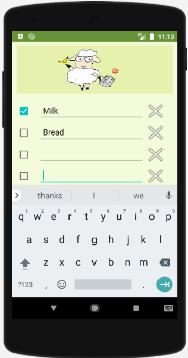

### ANDROID APP - Shopping List
This is my second Android app.  
It's a shopping list developed using Java, XML and Android Studio. 
I build it primarily to learn data persistence. It saves the item's name value using an SQLite database and items' ticked/unticked status using shared preferences.
 
 
If I was to improve it now, I would rebuild it using object-oriented programming and I would create an object that contains a string value for the item's name and a boolean value for the item's tick/untick status. I would also use exclusively SQLite to store the object's values rather than implementing shared preferences.

